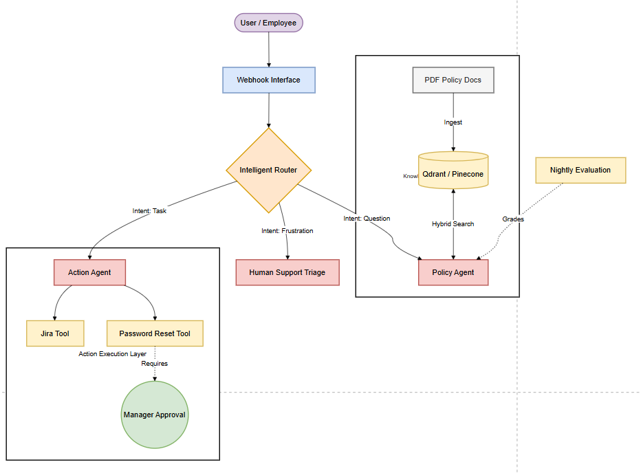

# Enterprise_IT_Support_Agent_n8n 🤖


An autonomous **Agentic RAG** system designed to resolve L1 IT support tickets. It features a "Human-in-the-Loop" (HITL) approval pipeline and utilizes **Llama 3.3** for semantic reasoning, routing user intents between knowledge retrieval and deterministic actions.

## Architecture Diagram



## 🚀 Executive Summary
This project reduces the operational load on IT Support teams by autonomously handling high-volume, low-complexity requests (e.g., policy questions, password resets). Unlike traditional chatbots that rely on keyword matching, this agent uses **Semantic Reasoning** to disambiguate vague intents and **Tool Calling** to execute actions securely.

## 🎯 Prototype Scope
This PoC was built to validate three core architectural hypotheses:
1.  **Feasibility:** Can Llama 3.3 (70B) accurately distinguish between a "Policy Question" (Read) and a "Ticket Request" (Write)?
2.  **Safety:** Can we implement a "Human-in-the-Loop" workflow to prevent the AI from executing unauthorized actions?
3.  **Latency:** Can we achieve sub-2-second response times using Groq's LPU inference engine?

*Note: This system uses Google Sheets as a database and Simple Memory (RAM) for conversational context.*

---

## 🚀 Key Features
* **Agentic Routing:** Decides dynamically whether to "Read" (Vector Search) or "Write" (Create Ticket).
* **RAG "Brain":** Uses **Llama 3.3** to answer technical questions based on a **Pinecone** vector database (Knowledge Base).
* **Zero-Trust Security:** Implements a "Human-in-the-Loop" workflow where database write-actions require asynchronous email approval.
* **Automated Evaluation:** A dedicated "Judge" workflow (Workflow 05) that grades agent responses against a ground-truth dataset.

---


## 🛠️ Tech Stack

| Component | Technology | Rationale |
| :--- | :--- | :--- |
| **Orchestration** | **n8n** (Self-Hosted) | Native support for LangChain & low-code workflow management. |
| **Reasoning Engine** | **Llama 3.3 70B** (via Groq) | High-speed inference (Groq LPU) for real-time agent interaction. |
| **Vector DB** | **Pinecone** (Serverless) | Scalable semantic search for policy documents. |
| **Embedding** | **HuggingFace** (MiniLM-L6-v2) | Efficient local embedding generation. |
| **Tools** | **Google Workspace** | Gmail (Notifications) & Sheets (Mock Database). |

---

## 📂 Workflow Architecture

The system is modularized into four distinct workflows to ensure separation of concerns:

### 1. Knowledge Ingestion Pipeline (ETL)
* **File:** `workflows/IT_Support_Agent_Indexing.json`
* **Function:** Automated ETL pipeline that extracts text from PDF policy documents (e.g., Employee Handbook), chunks them (500 chars), generates embeddings via HuggingFace, and upserts them to the Pinecone index.
* **Key Tech:** `RecursiveCharacterTextSplitter`, `Pinecone Vector Store`.

### 2. The "Brain" (Main Agent)
* **File:** `workflows/n8n_Support_Agent_main.json`
* **Function:** The central ReAct (Reason + Act) agent. It receives user chat input and uses Llama 3.3 to decide between:
    * **Tool A (Read):** "Answer questions with a vector store" (Retrieves policy info).
    * **Tool B (Write):** "create_ticket" (Triggers the sub-workflow).
* **Memory:** Uses `SimpleMemory` to retain conversational context.

### 3. The "Hands" (Ticket Request Tool)
* **File:** `workflows/Tool_Create_Ticket.json`
* **Function:** Handles the sensitive request to create a ticket.
* **Logic:** Instead of writing to the DB immediately, it generates a **Magic Link** containing the ticket payload and emails it to a supervisor.
* **UX Pattern:** "Fire and Forget". It immediately confirms to the user ("Approval email sent...") without blocking the chat UI.

### 4. The "Approver" (Asynchronous Webhook)
* **File:** `workflows/Ticket_Approver.json`
* **Function:** The security layer.
* **Trigger:** Activated only when the human supervisor clicks the email link.
* **Action:** Validates the payload and appends the row to **Google Sheets** (The "Database").
* **Feedback:** Serves a dynamic HTML page ("✅ Ticket Approved") to the approver.

---

## ⚙️ Setup & Installation

### Prerequisites
* n8n (Version 1.x or higher)
* Groq API Key
* Pinecone API Key
* Google Cloud Console (OAuth2 for Gmail & Sheets)

### Installation Steps
1.  **Clone the Repository:**
    ```bash
    git clone https://github.com/Vinaykiran1819/IT_Support_Agent_n8n.git
    ```
2.  **Import Workflows:**
    * Open n8n > **Workflows** > **Import from File**.
    * Select all JSON files in the `/workflows` directory.
3.  **Configure Credentials:**
    * Add your `Groq API`, `Pinecone Api`, and `Google Sheets OAuth2` credentials in n8n.
4.  **Run the Indexing:**
    * Open `IT_Support_Agent_Indexing` and click **Execute Workflow** to seed your vector database.

---

## 📊 Evaluation & Metrics (Phase 4)

I implemented an **"LLM-as-a-Judge"** evaluation pipeline to move beyond manual testing.
* **Retrieval Accuracy:** Tested against "Needle in a Haystack" queries (e.g., specific leave policy tables).
* **Hallucination Rate:** Minimizing incorrect policy invention via strict Prompt Engineering ("If unsure, ask for a ticket").
* **Ground Truth:** Validated against the *Mississippi State Employee Handbook* and *Springfield College Security Policy*.

---

## 🔮 Future Improvements
* **Slack Integration:** Deploying the Chat Trigger to a Slack App for native enterprise use.
* **Redis Memory:** Replacing simple memory with persistent Redis memory for long-term user context.
* **Code Interpreter:** Adding a Python tool for complex leave balance calculations.

---

### Author
**Vinay Kiran Reddy Chinnakondu** |
*Founding AI Engineer*